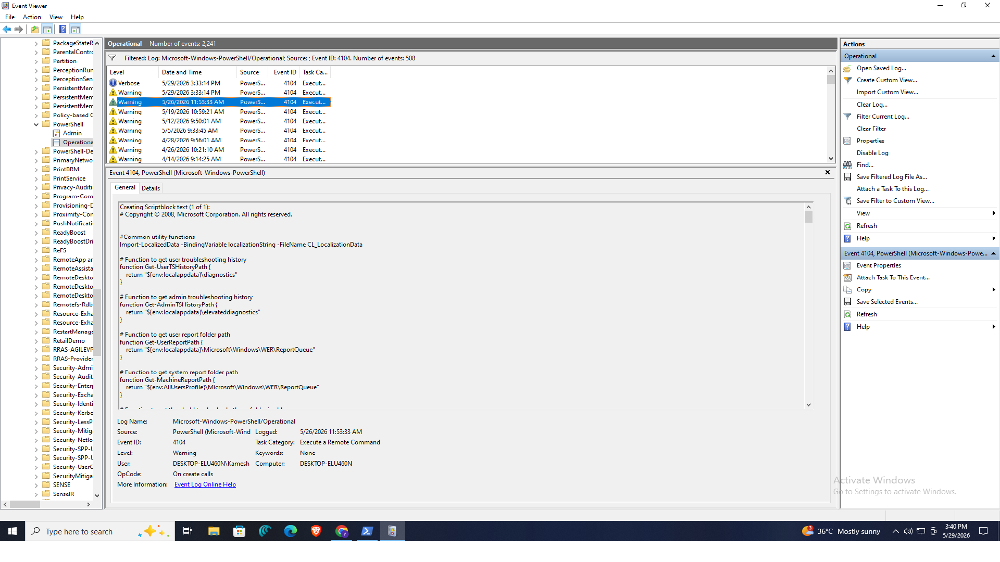
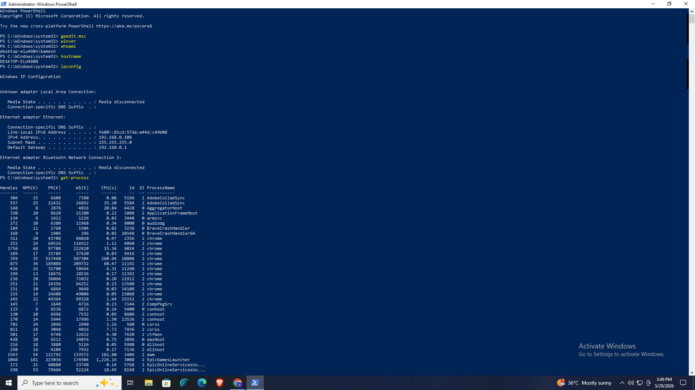
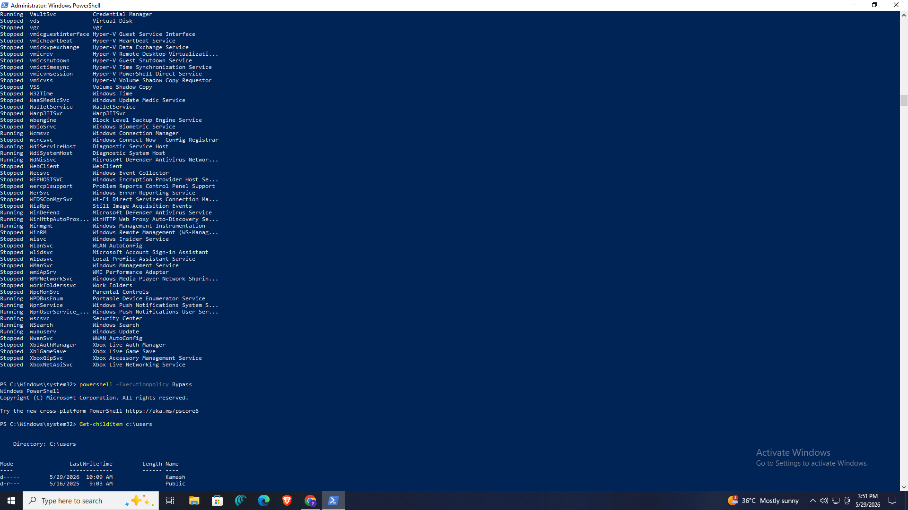
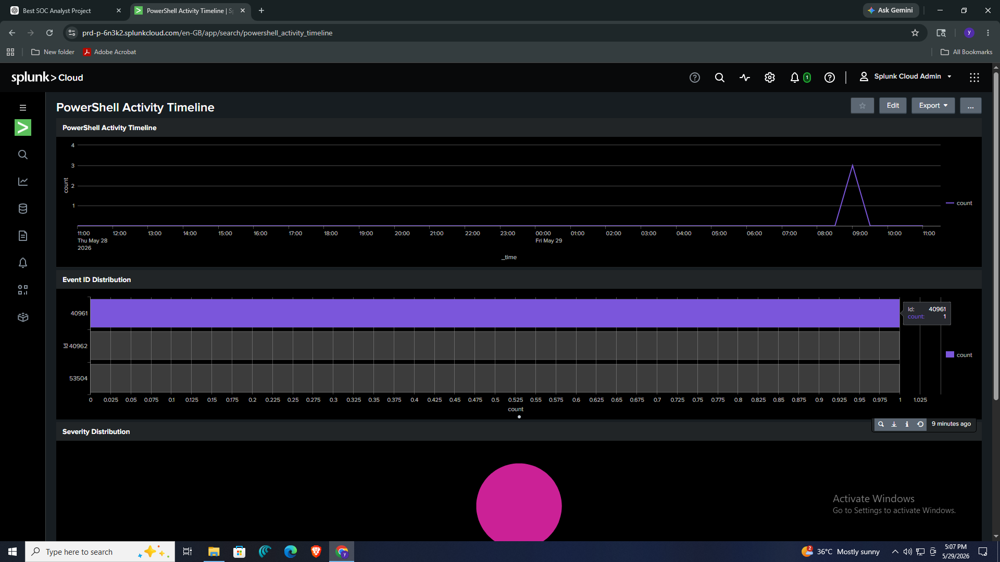
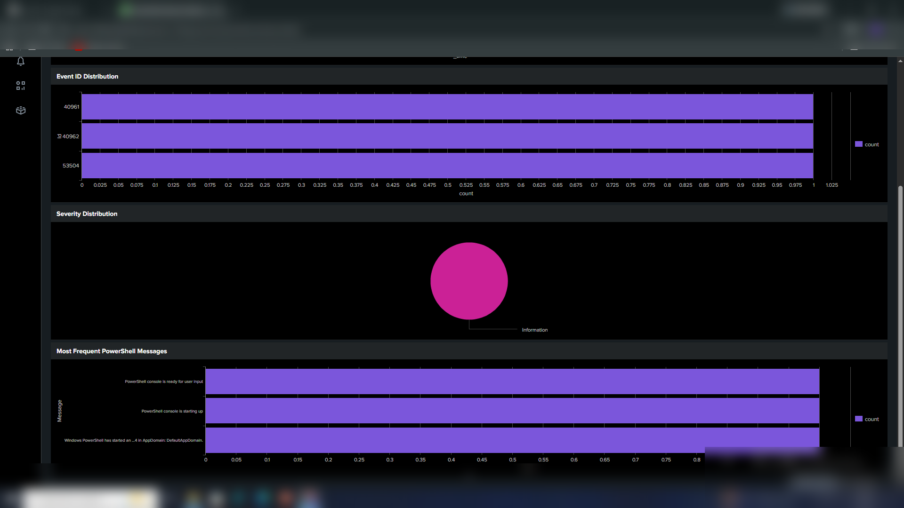
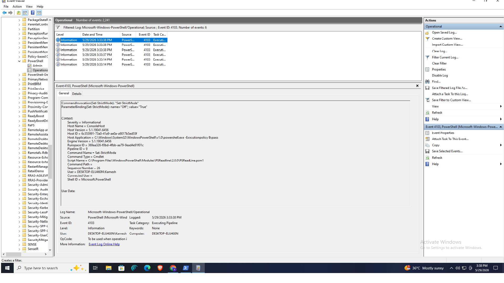

# PowerShell Log Analysis in Splunk

## Project Overview
This project demonstrates an end-to-end SOC-style investigation of **PowerShell activity logs** collected from a Windows system and analyzed in **Splunk Cloud**. The objective of the project was to generate PowerShell activity on a Windows host, inspect the corresponding **Windows Event Logs** in Event Viewer, ingest the relevant log data into Splunk, and build a dashboard to visualize execution activity, event distribution, severity levels, and frequently occurring PowerShell messages.

The project focuses on how a SOC analyst can use **Windows PowerShell Operational logs** to identify suspicious or noteworthy PowerShell behavior, monitor command execution, and create timeline-based visualizations for incident investigation.

---

## Objectives
- Generate PowerShell activity on a Windows host
- Observe and validate PowerShell logs in **Event Viewer**
- Identify relevant PowerShell event IDs
- Ingest PowerShell-related logs into **Splunk Cloud**
- Create a Splunk dashboard for log analysis and visualization
- Perform basic investigation of PowerShell execution patterns

---

## Tools & Technologies Used
- **Windows 10 / Windows PowerShell**
- **Event Viewer**
- **Splunk Cloud**
- **PowerShell Operational Logs**
- **Windows Administrative Tools**

---

## Lab Environment
### Target System
- **OS:** Windows
- **Hostname:** DESKTOP-ELU460N
- **User:** Kamesh
- **PowerShell Activity Source:** Microsoft-Windows-PowerShell/Operational

### SIEM Platform
- **Splunk Cloud** used for log ingestion, search, and dashboard creation

---

## PowerShell Event IDs Observed
During the investigation, PowerShell Operational logs were monitored using Event Viewer. The following event IDs were identified in the screenshots and used for analysis:

- **Event ID 4103** – PowerShell pipeline execution / command invocation details
- **Event ID 4104** – PowerShell script block logging / script block content
- **Event ID 40961 / 40962 / 53504** – PowerShell-related events visible in Splunk dashboard visualizations

> Note: In this project, the key investigation focus was on **PowerShell Operational events**, especially **4103** and **4104**, because they provide visibility into PowerShell execution and script activity.

---

## Attack / Activity Simulation Performed
To generate PowerShell logs for analysis, multiple commands were executed from an elevated PowerShell session. These activities included:

- Checking Windows version
- Identifying current user and hostname
- Viewing IP configuration
- Listing running processes
- Listing Windows services
- Starting PowerShell with **ExecutionPolicy Bypass**
- Enumerating user directories under `C:\Users`

Example commands executed:
```powershell
winver
whoami
hostname
ipconfig
Get-Process
Get-Service
powershell -ExecutionPolicy Bypass
Get-ChildItem C:\Users
```
## Investigation Workflow

The investigation followed a simple SOC workflow:

- Generate PowerShell activity on the Windows host
- Validate PowerShell logs in Event Viewer
- Identify important event IDs such as 4103 and 4104
- Ingest the log data into Splunk
- Search and filter PowerShell events
- Build dashboard panels for timeline and event analysis
- Interpret findings from event distributions and PowerShell messages
- Event Viewer Analysis
## 1. PowerShell Script Block / Execution Logging

The first part of the investigation involved checking the Microsoft-Windows-PowerShell/Operational log in Event Viewer. This log showed PowerShell execution events and script-related records.

## Key Observation:
- Event ID 4104 was observed in the PowerShell Operational log
- The event details contained script block content
- This helps analysts inspect PowerShell code or script content executed on the endpoint
-Security Relevance

Event ID 4104 is valuable because attackers often use PowerShell for:

- reconnaissance
- downloading payloads
- privilege escalation support
- lateral movement
- defense evasion

Being able to inspect script blocks helps a SOC analyst identify suspicious commands or malicious automation.

## 2. PowerShell Pipeline Execution Event

The investigation also identified Event ID 4103 in the PowerShell Operational log.

## Key Observation:

The event details showed:

- command invocation information
- host application path
- command names
- script names
- execution context
- user and host details
## Security Relevance

Event ID 4103 is useful because it records PowerShell command execution and pipeline activity, which can help analysts understand:

what commands were run
by which user
from which host process
in what execution context

## PowerShell Activity Generated
Commands Executed on Windows Host

The following activities were performed to create logs for analysis:

System and User Enumeration:
```powershell
whoami
hostname
winver
ipconfig
```
Process and Service Enumeration
```powershell
Get-Process
Get-Service
```
PowerShell Execution Policy Bypass
```powershell
powershell -ExecutionPolicy Bypass
```
User Directory Enumeration
```powershell
Get-ChildItem C:\Users
```
## Splunk Dashboard Analysis

A Splunk dashboard named PowerShell Activity Timeline was created to analyze the ingested PowerShell logs.

Dashboard Panels Created
## 1. PowerShell Activity Timeline

This panel visualizes PowerShell activity over time.
It helps identify:

- when PowerShell commands were executed
-spikes in execution activity
- the time period of suspicious or interesting events
## 2. Event ID Distribution

This panel displays the frequency of PowerShell-related event IDs found in the ingested data.

From the dashboard screenshots, event IDs such as:

-40961
-40962
-53504

were visualized for count-based comparison.

This helps analysts quickly understand which event types are most common in the dataset.

## 3. Severity Distribution

This panel visualizes the severity or level associated with PowerShell events.

It helps answer:

- whether most events are informational
- whether warning or suspicious events are present
- how severe the observed activity appears from a logging perspective
## 4. Most Frequent PowerShell Messages

This panel shows the most common PowerShell-related messages in the collected logs.

This is useful to identify repeated activity such as:

- PowerShell console startup
- command execution initialization
- repeated script or module usage

## Sample Splunk Queries

1. View all PowerShell events
```powershell
index=* sourcetype=*powershell*
```

## 3. Search PowerShell Operational events
```powershell
index=* source="WinEventLog:Microsoft-Windows-PowerShell/Operational"
```
## 4. Count events over time
```powershell
index=* source="WinEventLog:Microsoft-Windows-PowerShell/Operational"
| timechart count
```
5. Event ID distribution
```powershell
index=* source="WinEventLog:Microsoft-Windows-PowerShell/Operational"
| stats count by EventCode
```
## 7. Severity / level distribution
```powerhsell
index=* source="WinEventLog:Microsoft-Windows-PowerShell/Operational"
| stats count by Level
```
## 8. Most frequent PowerShell messages
```powershell
index=* source="WinEventLog:Microsoft-Windows-PowerShell/Operational"
| top Message limit=10
```
## 9. Filter for Event ID 4103
```powershell
index=* source="WinEventLog:Microsoft-Windows-PowerShell/Operational" EventCode=4103
```
## 10. Filter for Event ID 4104
```powershell
index=* source="WinEventLog:Microsoft-Windows-PowerShell/Operational" EventCode=4104
```
## 11. Timeline of PowerShell event IDs
```powershell
index=* source="WinEventLog:Microsoft-Windows-PowerShell/Operational"
| timechart count by EventCode
```
## MITRE ATT&CK Mapping

Although this project is primarily a log analysis and monitoring project, PowerShell activity is commonly associated with multiple ATT&CK techniques.

Possible ATT&CK Mapping:
- T1059.001 – Command and Scripting Interpreter: PowerShell
- T1082 – System Information Discovery
- T1083 – File and Directory Discovery
- T1049 – System Network Connections Discovery
- T1057 – Process Discovery
- T1007 – System Service Discovery
  
## Mapping from executed commands
- ipconfig → System Network Discovery
- Get-Process → Process Discovery
- Get-Service → Service Discovery
- Get-ChildItem C:\Users → File and Directory Discovery
- powershell -ExecutionPolicy Bypass → suspicious PowerShell execution behavior often investigated under PowerShell abuse / execution
  
## Key Findings

- PowerShell activity was successfully generated on the Windows endpoint.
- Relevant events were visible in Microsoft-Windows-PowerShell/Operational logs.
- Event ID 4103 and 4104 provided useful visibility into PowerShell command execution and script activity.
- PowerShell logs were ingested into Splunk Cloud for centralized monitoring.
- A custom Splunk dashboard was created to visualize:
   - activity timeline
   - event ID distribution
   - severity distribution
   - frequent PowerShell messages
- The project demonstrates how PowerShell logs can support SOC investigations, especially when analyzing suspicious scripting activity.
  
## Screenshots

### 1. PowerShell Event ID 4104 in Event Viewer


### 2. PowerShell Activity Generated in Windows PowerShell


### 3. Additional Process and Service Enumeration Activity


### 4. PowerShell Execution Policy Bypass and User Enumeration


### 5. Splunk PowerShell Activity Timeline Dashboard


### 6. Splunk Event ID, Severity, and Frequent Messages Panels


### 7. Event ID 4103 in Event Viewer


Conclusion

This project demonstrates a practical PowerShell log analysis workflow using Windows Event Viewer and Splunk Cloud. By generating PowerShell activity, validating event logs, and building Splunk dashboards, the project shows how PowerShell telemetry can be used for SOC investigations and threat hunting. It is a useful beginner-to-intermediate SOC project because it combines Windows log analysis, event interpretation, Splunk searching, dashboard creation, and basic ATT&CK mapping into a single workflow.
